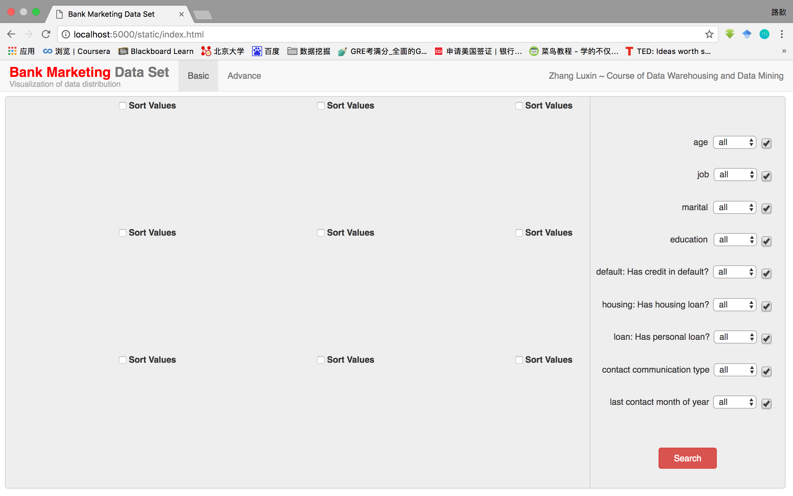
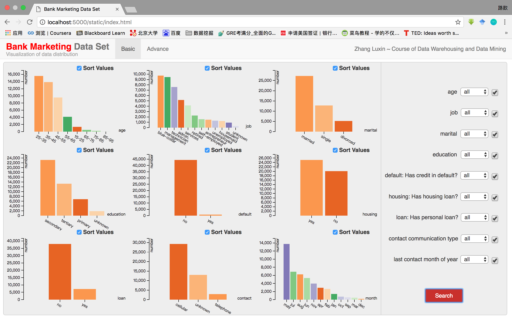
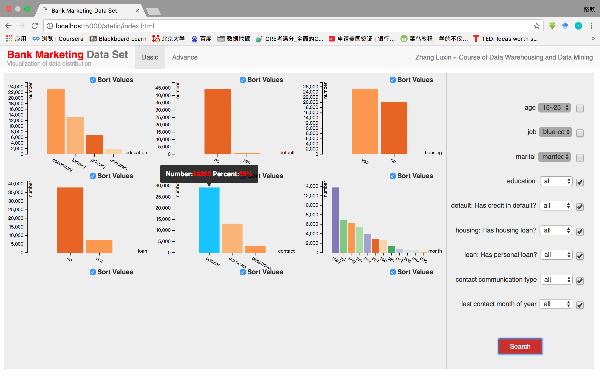
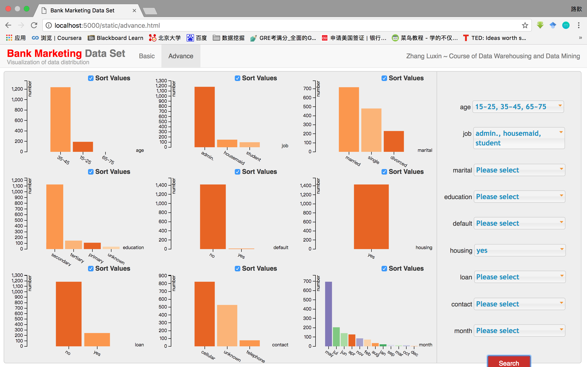

# Visualization of Bank Marketing Data Set

## Introduction

This is the course project of _Data Warehousing and Data Mining Technology_ at Peking University.

This project consists of client, server and database, aiming to visualize the distribution of the [Bank Marketing Data Set](https://archive.ics.uci.edu/ml/datasets/Bank+Marketing).

## Client
The client is implemented by _HTML/CSS_ and _JavaScript_. I used _Bootstrap_ and _jQuery_ to simplify the process. What's more, the visualization work is under the help of the powerful interactive data visualization tool ------_[D3.js](https://d3js.org/)_.

The documents for client are contained in the folder _static_.

## Server
The server is coded with _Python_, under the framework of _Flask_.

The document for server is the file _app.py_.


## Database
The database I use is _MySQL_. It's easy and free to establish your own databases through _MySQL_.

The file to establish the database is _setup\_database.sql_.


##About the Data
The data used in this project is the [Bank Marketing Data Set](https://archive.ics.uci.edu/ml/datasets/Bank+Marketing). It contains 45211 records. Each record consists of 17 attributes. I only select 9 of them to visualize their distribution.

The data is in the folder _data_.

## Usage
1. Download the project and put the project folder on the _Desktop_.
2. Open MySQL on your terminal. Run the _setup_database.sql_ file to establish the database.
```SQL
$ source ~/Desktop/BankMarketingDataSet-master/setup_database.sql
```
3. Run the server on your terminal.
```python
$ python app.py
```
4. Open your browser (better using _Chrome_ in full-screen mode) and visit _localhost:5000_. Then enjoy playing with it!

## Some Results




